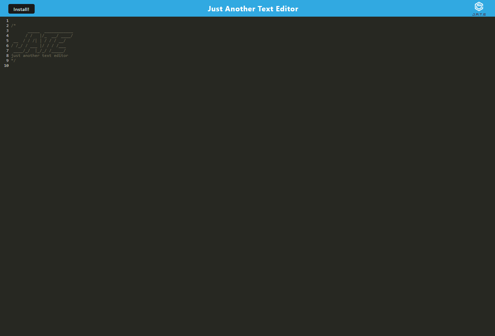

# text_editor_pwa #

**Note:** This repository contains my source code for a text editor PWA created for Challenge 19 as part of GA Tech's 2022 Coding Bootcamp.

## Description ##

With the previous decade's boom of people accessing the internet through their portable devices the necessity for mobile compatible web applications has never been higher. While application stores serve their purpose the truth is that the special programming languages required limits creativity in the field. Wouldn't it be nice if there was another way to develop and install these applications that uses common web development languages? Look towards PWAs! Here is a simple application to demonstrate the technology.

The concept of this application is simple, it is a web based text-editor that, through the use of webpack and babel, can easily be installed by users on their desktop or portable device through the web-browser. Simply click "Install!" at the top left hand side of the website and a prompt will appear. Now you can enjoy this text editor anywhere you are even if offline! It makes use of caching and IndexedDB storage to speed up loading and save your progress.

Give it a test run today!

## Live Website ##

https://text-editor-pwa-devin.herokuapp.com/

## Screenshot ##

